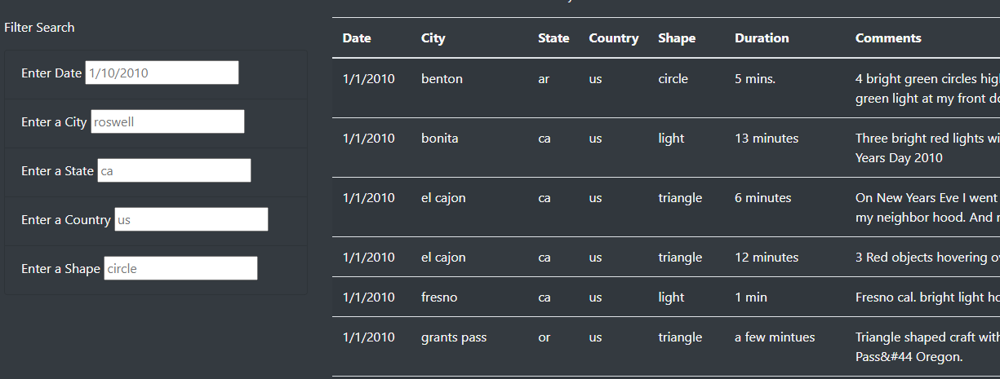
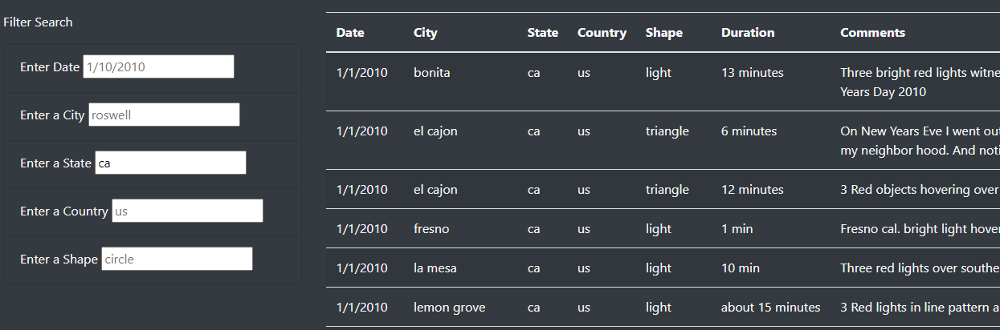
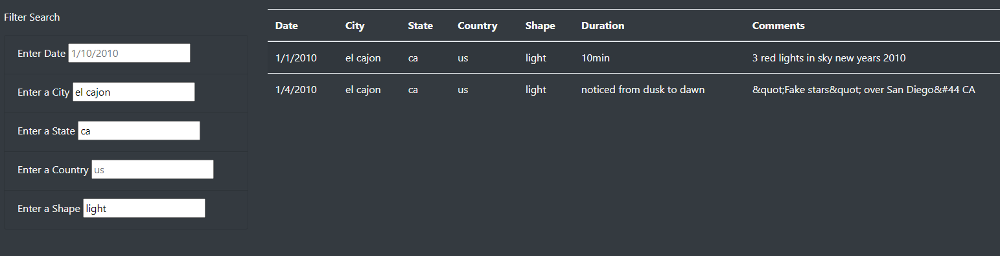

# UFOs with JavaScript

## Overview - Purpose

As a fun side hobby, Dana has asked us to build a website about UFO sightings. On the website there is a jumbotron header, an article header with a small article, as well as a table on UFO sightings that can be filtered. Our goal is to make it so the table can be filtered by multiple criteria at the same time. The filter options are by date, city, state, country, and UFO shape. 

## Results - How To Use

The website starts with the table automatically filled with all the data, and the input boxes empty, as shown in the image above. The inputs show placeholder values in grey so that you have an idea of the kind of values that might exist in the dataset. To filter the table you enter a value into one of the input boxes and either press enter or click outside of the box. Your entry will appear as black text in the input box, and you should see the table immediately update to either show filtered data (like in the image below) or no data, if what you entered wasn't in the dataset. You can enter multiple filters to get the results down to just a few entries, as shown in the final image. 

## Summary

The current design listens for any change in the inputs and immediately applies it to the table. This means that if you had three filter criteria, the table updates after each one is entered. This could greatly slow down the website, particularly if there was more data and more users. One recommendation would be to add a button to press after a user has entered all of their search requirements, that way the table would only be rebuilt once. For some of these filters, like Country or Shape, the users may not know what the options are. Therefore, another recommendation could be to use dropdown boxes rather than input boxes. A final recommendation would be to include another input filter that uses regex to try to match a word or two in the comments. For instance, filtering for an entry that says red light. 
